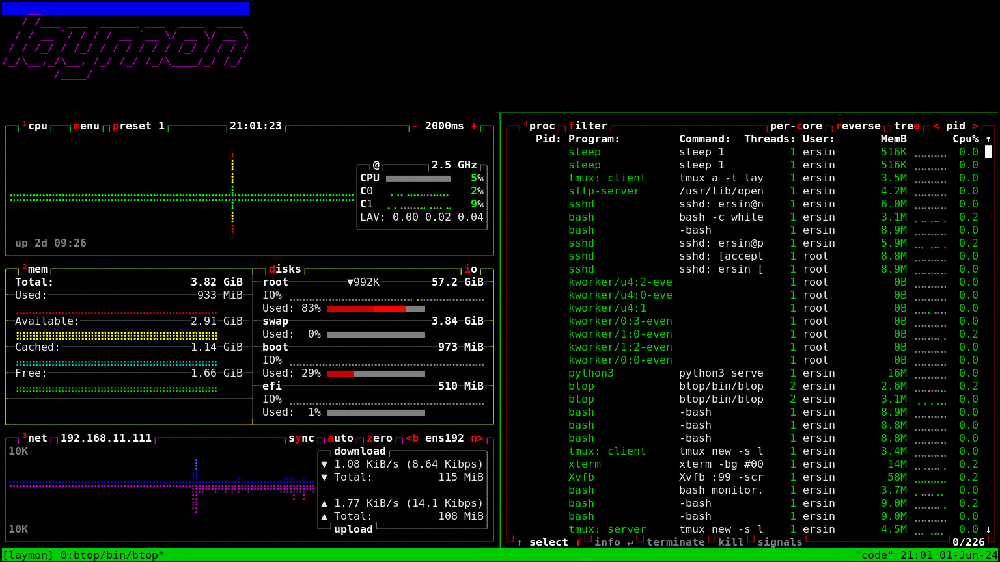

# Laymon

Layman's Monitoring Tool.

Distributed monitoring tool for linux machines, composed of: tmux, monitoring tools and a web server.

## Monitoring Tools

[btop](https://github.com/aristocratos/btop)

## Installation

```
sudo cp btop/bin/btop /usr/local/bin

sudo apt-get install xvfb x11-apps imagemagick

pip install -r requirements.txt
```

## Run

Save presets of btop.

1: cpu, disk, net
2: proc


```
bash monitor.sh
```

Access at http://localhost:13000



